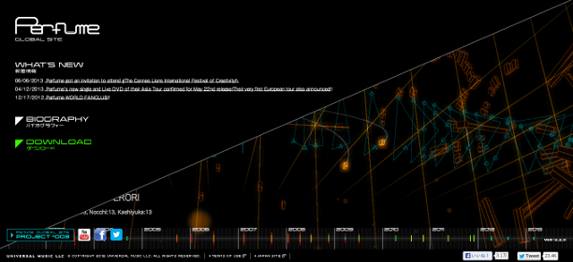

# perfumedance\_p5 README
## はじめに

これは [Perfume Global Site](http://www.perfume-global.com/)で配布されているダンスモーションを [Processing](http://processing.org/) で可視化する[サンプルプログラム](https://github.com/perfume-dev/example-processing) に、改造しやすくなるよう手を加えたものです。

### オリジナルとの差分

- ポリゴンが裏返っているのを解消
- [Minim](http://code.compartmental.net/tools/minim/) を標準で組込
- 公式配布データ用にあらかじめ設定変更
- その他見た目の細かい調整

## 使い方

まずは本プログラムを展開します。お使いの Processing 用のスケッチブック保存フォルダの中に、本プログラムを展開してください。ZIP ファイルで入手した場合は、展開された perfumedance\_p5 というフォルダをそのままスケッチブック保存フォルダに置いてください。

次にダンスモーションのデータと楽曲データを下記サイトからダウンロードしましょう。

- [Perfume Global Site](http://www.perfume-global.com/)

2013年9月現在、上記サイトにアクセスすると二つのリンクがありますが、"Perfume Global Site" と書かれた左側のリンクを辿ってください。その後表示されるページの左上隅にナビゲーションエリアがあり、マウスカーソルを近付けると下図のような画面になりますので、「Download」を選択しクリックしてください。



続くページの「Vol.01 Motion Capture Data」の欄に、ダウンロード用リンクが表示されています。"Terms of use" というリンクに、データの使用上の注意が書かれていますので、よく読んで納得したら "You agree to our terms" にチェックを入れ、"BVH" および "SOUND" のリンクをクリックすると、それぞれの ZIP ファイルがダウンロードされます。

次に、ダウンロードしたファイルを展開します。まずダンスモーションデータが格納されている bvhfiles.zip を展開し、その中に含まれている下記のみっつのファイルを、perfumedance\_p5/data の中に置きます。

- aachan.bvh
- kashiyuka.bvh
- nocchi.bvh

また、Perfume\_globalsite\_sound.wav.zip を展開し、その中に含まれている Perfume\_globalsite\_sound.wav もやはり perfumedance\_p5/data の中に置きます。

以上のファイルが用意できたら、まずは実行してみて、Perfume の三人が音楽にあわせて踊っているグラフィクスが見られるかどうかを確認してみてください。もしうまく行かない場合は、上述した各種ファイルの置き場所が間違っている可能性があります。

## 改造のポイント

プログラムのあちこちをいじってみることで、感覚的にプログラムの仕組みや 3D CG の動かし方を学んでいくとよいでしょう。以下に、とっかかりの改造ポイントを記しますので参考にしてください。

### 大きさを変える

頭や身体のパーツの大きさを変えてみましょう。身体を描く部分は PBvh.pde の中に記述されています。Processing のエディタ上で PBvh.pde のタブを開き、下記の箇所を探してみましょう。

```java
        translate( b.absEndPos.x, b.absEndPos.y, b.absEndPos.z);
        sphere(20);
```

ここは頭や手足の先の部分を描写している部分です。この [`sphere(20)`](http://processing.org/reference/sphere_.html) は、半径20の球を表示する関数です。この`20`の部分の数値を大きくしたり小さくしてみて、何が起きるか見てみましょう。ちょっと変えたくらいではわかりませんので、極端に大きくしたり小さくしてみたり、何度も試してみてください。

また、腕や脚の部分を描いているのは以下の部分です。

```java
      translate(b.absPos.x, b.absPos.y, b.absPos.z);
      ellipse(0, 0, 5, 5);
```

ここでも、[`ellipse`](http://processing.org/reference/ellipse_.html) の後ろにある数値を色々と変えてみましょう。それぞれの数値がどんな意味を持っているのか、描かれたグラフィクスから推測してみてください。

### 形を変える

次は形を変えてみましょう。さっきの `sphere` の部分を [`box`](http://processing.org/reference/box_.html) に変えてみると…

`ellipse` の方も変えてみましょう。三角形を描くなら、[`triangle`](http://processing.org/reference/triangle_.html) を使います。

```java
      triangle(0, 5, -5, -5, 5, -5);
```

と書いてみましょう。他にも色々な図形を試してみてください。

### 音に反応させる

本プログラムでは、FFT を使った音の周波数解析のための基本的なコードが組込まれています。試しにそれを使ってみましょう。

`soundLevel` というグローバル変数が定義されており、これは `draw()` の瞬間にどれくらいの音圧がかかっていたかを示すようになっています。この曲の場合、最高でだいたい 3000 くらいの値になります。この値を使って球の大きさを変えてみましょう。PBvh.pde の中の該当箇所を

```java
        sphere(soundLevel / 100);
```

としてみてください。音に合わせて球の大きさが変化しますね。

周波数解析の結果を上手に使うと、例えば音域の低い音や高い音にそれぞれ反応するようなアニメーションを作ることができます。コードの中では、

```java
  soundLevel = 0;
  for (int i=0; i<fft.specSize(); i++) {
    soundLevel += fft.getBand(i);
  }
```

を見てみると、周波数毎の値を取り出す方法が見えてくると思います。

Processing では、[minim](http://code.compartmental.net/tools/minim/) というライブラリが音まわりを担当しています。[minim のドキュメント](http://code.compartmental.net/tools/minim/manual-fft/)もあわせて参考にしてください。

### ボーンの描画の仕方

※あとで書く
